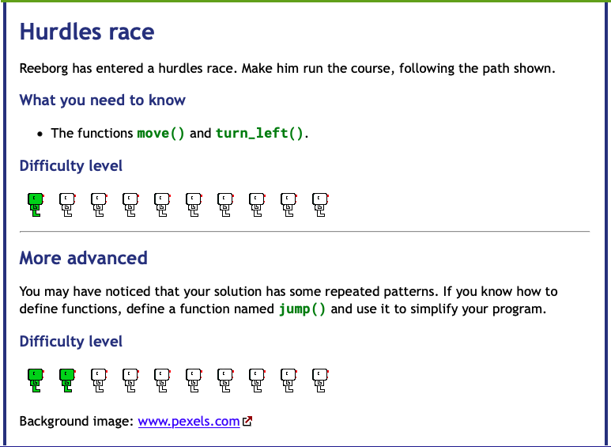
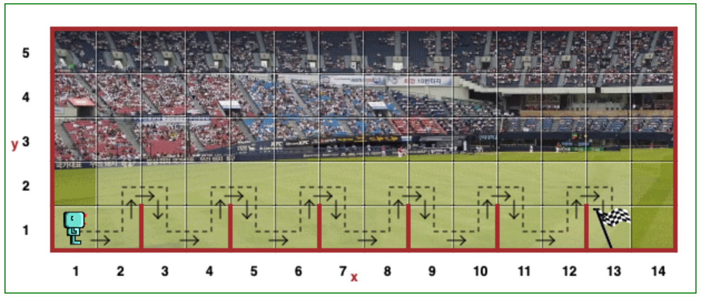
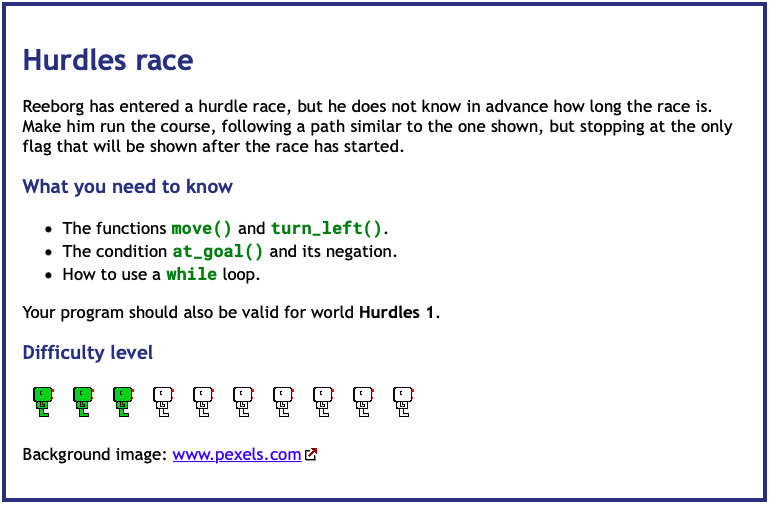

# Day 6 Functions & Karel

## Exercise 6-1: Hurdle Challenge

### Instructions

[Reeborg World](https://reeborg.ca/reeborg.html?lang=en&mode=python&menu=worlds%2Fmenus%2Freeborg_intro_en.json&name=Hurdle%201&url=worlds%2Ftutorial_en%2Fhurdle1.json)
    
A robot located at (x, y) = (1, 1) carries no object.

GOAL: Move the robot along the path to the final position of (13,1)

Create a function `jump()` to move the robot over the hurdles
Shorten the code by using a FOR loop that executes the function

## Exercise 6-2: Hurdle Challenge 2

### Instructions

[Reeborg World 2](https://reeborg.ca/reeborg.html?lang=en&mode=python&menu=worlds%2Fmenus%2Freeborg_intro_en.json&name=Hurdle%202&url=worlds%2Ftutorial_en%2Fhurdle2.json)

A robot located at (x, y) = (1, 1) carries no object.

GOAL: Move the robot along the path to the final position chosen at random

Create a function `jump()` to move the robot over the hurdles
Shorten the code by using a WHILE loop that executes the function

This code should check the `at_goal()` function and stop when `True`