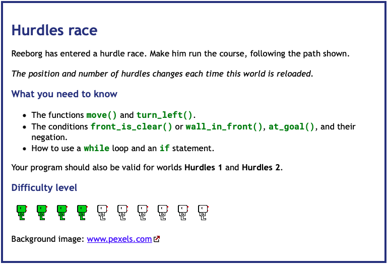
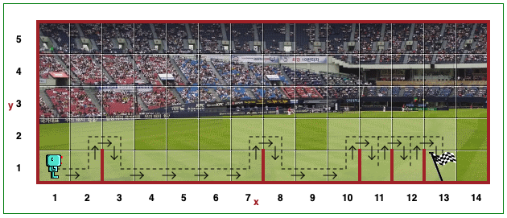
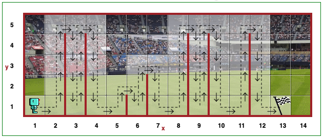
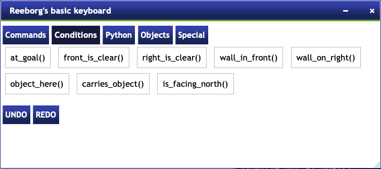

# Day 6 Functions & Karel

## Exercise 6-1: Hurdle Challenge

### Instructions

[Reeborg World - Hurdle Challenge](https://reeborg.ca/reeborg.html?lang=en&mode=python&menu=worlds%2Fmenus%2Freeborg_intro_en.json&name=Hurdle%201&url=worlds%2Ftutorial_en%2Fhurdle1.json)
    
A robot located at (x, y) = (1, 1) carries no object.

**GOAL:** Move the robot along the path to the final position of (13,1)

Create a function `jump()` to move the robot over the hurdles.

Shorten the code by using a FOR loop that executes the function.

## Exercise 6-2: Hurdle Challenge 2

### Instructions

[Reeborg World - Hurdle Challenge 2](https://reeborg.ca/reeborg.html?lang=en&mode=python&menu=worlds%2Fmenus%2Freeborg_intro_en.json&name=Hurdle%202&url=worlds%2Ftutorial_en%2Fhurdle2.json)

A robot located at (x, y) = (1, 1) carries no object.

This challenge will randomise the position of the flag.

**GOAL:** Move the robot along the path to the final position chosen at random

Create a function `jump()` to move the robot over the hurdles.

Shorten the code by using a WHILE loop that executes the program functions.

This code should check the `at_goal()` function and stop when `True`, using the negation: `not at_goal()`.

**Important** The final code should also work with Hurdle 1 Challenge.

## Exercise 6-3: Hurdle Challenge 3

### Instructions

[Reeborg World - Hurdle Challenge 3](https://reeborg.ca/reeborg.html?lang=en&mode=python&menu=worlds%2Fmenus%2Freeborg_intro_en.json&name=Hurdle%203&url=worlds%2Ftutorial_en%2Fhurdle3.json)

A robot located at (x, y) = (1, 1) carries no object.

This challenge will randomize the number of hurdles and placements.

**GOAL:** Move the robot along the path to the final position of (13,1)

Use your `jump()` function to move the robot over the hurdles.

You will use the `front_is_clear()` or `wall_in_front()` functions to check hurdles, using negation.

    i.e. not front_is_clear() or not wall_in_front()

Shorten the code by using a WHILE loop that executes the program functions.

This code should check the `at_goal()` function and stop when `True`, using the negation: `not at_goal()`.

**Important** The final code should also work with Hurdle 1 and Hurdle 2 Challenges.

## Exercise 6-3: Hurdle Challenge 4

### Instructions

[Reeborg World - Hurdle Challenge 4](https://reeborg.ca/reeborg.html?lang=en&mode=python&menu=worlds%2Fmenus%2Freeborg_intro_en.json&name=Hurdle%203&url=worlds%2Ftutorial_en%2Fhurdle3.json)

A robot located at (x, y) = (1, 1) carries no object.

This challenge will randomize the number of hurdles, hurdle heights, and placements.

**GOAL:** Move the robot along the path to the final position of (13,1)

You can use the codes available for this challenge listed here along with your `jump()` function:

Shorten the code by using a WHILE loop that executes the program functions.

This code should check the `at_goal()` function and stop when `True`, using the negation: `not at_goal()`.

**Important** The final code should also work with Hurdle 1, Hurdle 2 and Hurdle 3 Challenges.