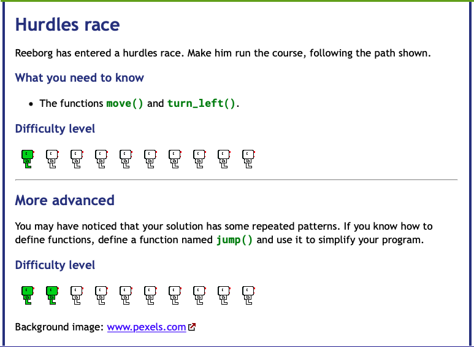

# Day 6 Functions & Karel

## Exercise 6-1: Hurdle Challenge

### Instructions
    
A robot located at (x, y) = (1, 1) carries no object.

GOAL: Move the robot along the path to the final position of (13,1)

