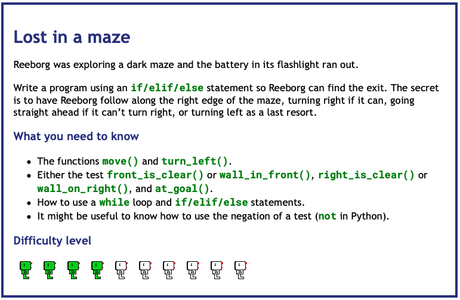
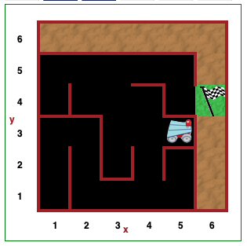
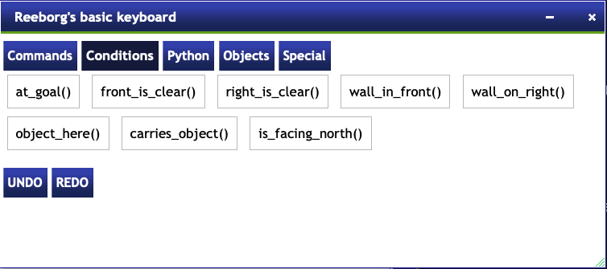

# Day 6 Functions & Karel

## Project: Escape the Maze

### Instructions

[Reeborg World - Maze](https://reeborg.ca/reeborg.html?lang=en&mode=python&menu=worlds%2Fmenus%2Freeborg_intro_en.json&name=Maze&url=worlds%2Ftutorial_en%2Fmaze1.json)
    
A robot located at (x, y) = (1, 1) carries no object.

This challenge will randomize the starting position of the robot.

**GOAL:** Move the robot along the maze path to the final position of (6,4)

You can use the functions available for this challenge listed here:

