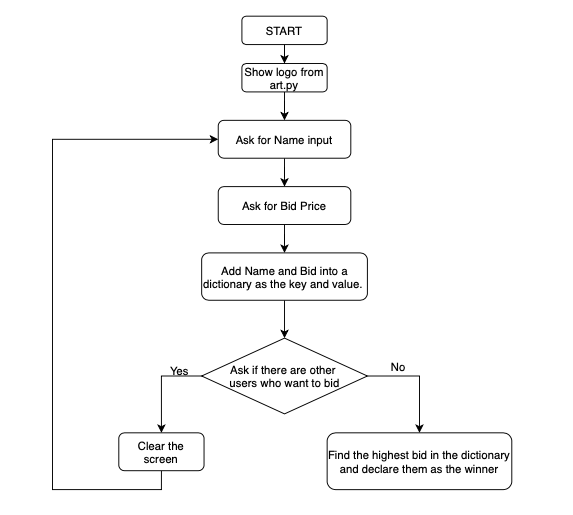

# Day 9 Secret Auction

### Instructions

1. Import and print the logo from art.py when the program starts.

2. Get user input for:
    1. Name (key)
    2. Bid Amount (value)

3. Add name and bid amount to a dictionary as key and value

4. Ask if there are any other users who want to bid
    1. If `YES`:
       1. Clear the screen
       2. Loop again
    2. If `NO`:
       1. Find the highest bid in the dictionary
       2. Declare them the winner

