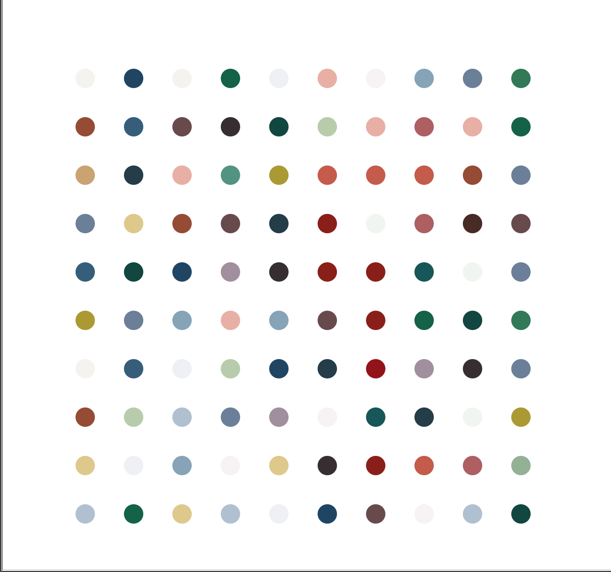

# Day 18 Turtle: GUI

## Overview

Day 18 starts with learning how to work with Turtle GUI and finally building a project that uses Turtle to build a work of art.

      Exercise 18.1 - Draw a square
      Exercise 18.2 - Draw a dashed line
      Exercise 18.3 - Drawing different shapes
      Exercise 18.4 - Generate a random walk
      Exercise 18.5 - Draw a spirograph

## Project: Hirst Painting

Using the Turtle package, we will build a program that will recreate a similar image to `image.jpg` included in the directory.

### Instructions

1. Extract the colors from `image.jpg` using colorgram
2. With these colors, recreate a `10 x 10` image with dots
   1. Each dot should be a random color from the extracted list
   2. Each dot should be spaced `50` paces apart
   3. Each dot should be `20` in size
3. Start from the bottom left to right and move up the rows
4. There should be `100` dots in total

### Example Output

### Replit Demo

[Replit Demo - Hirst Painting](https://replit.com/@EoghyUnscripted/Hirst-Painting)