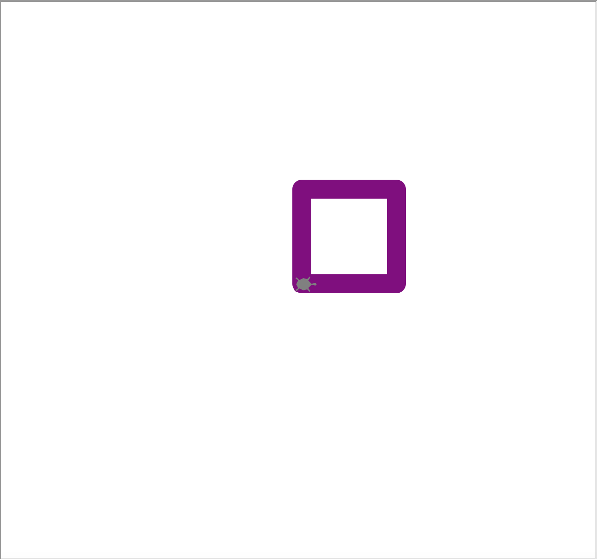
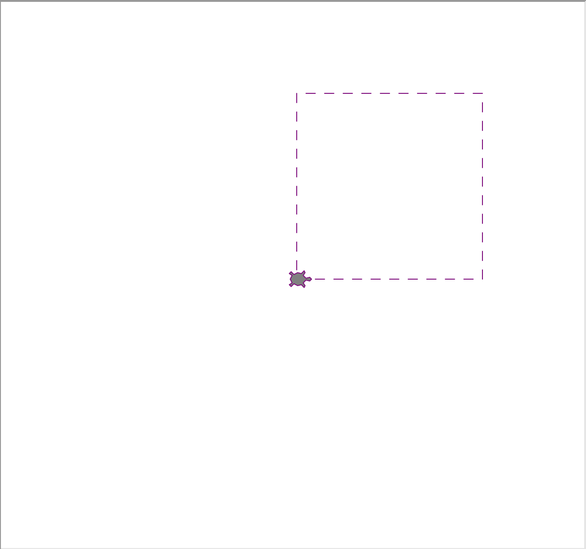
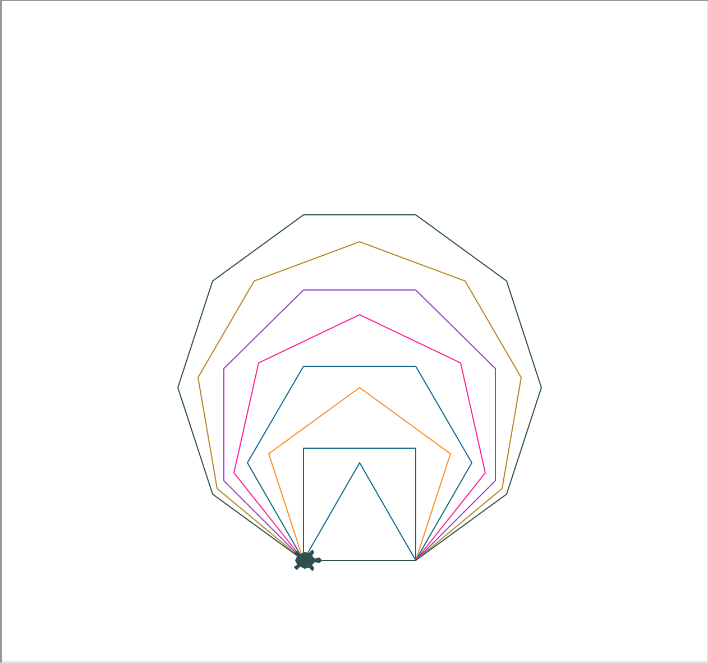
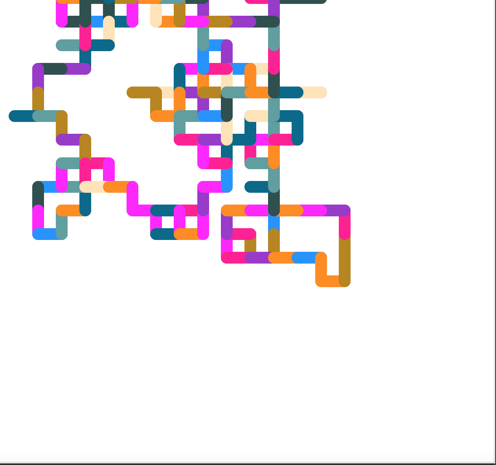
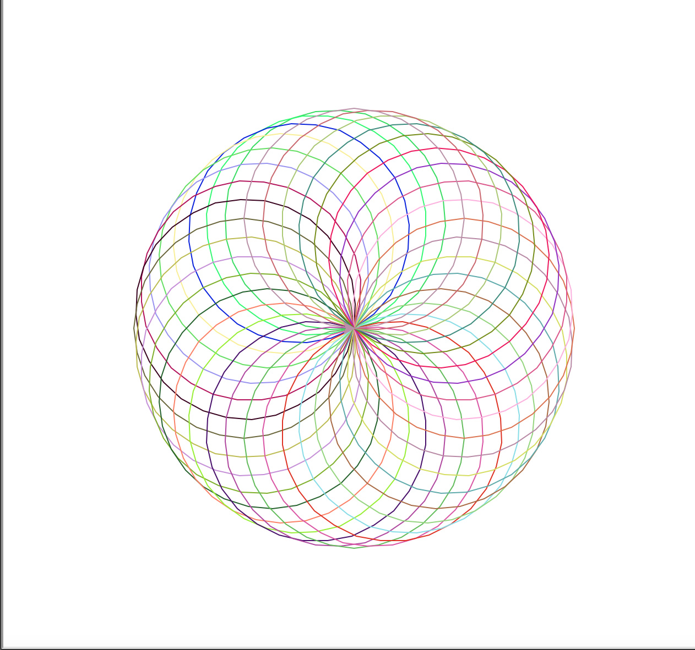

# Day 18 Turtle: GUI

## Exercise 18-1: Draw a Square

### Instructions

1. Using Turtle, draw a square on the `screen()`
2. Change the color of the pen
3. Change the shape to a `turtle`

### Example Output

## Exercise 18-2: Draw a Dotted Line

### Instructions

1. Using Turtle, draw a dotted line on the `screen()`
2. Use `penup()` or `pu()` and `pendown()` or `pd()`

### Example Output

## Exercise 18-3: Drawing Different Shapes

### Instructions

1. Build a program that will randomly change the color of each shape
2. Create a variable for `angle` to draw the correct amount sides
3. Draw these shapes:
   1. Triangle
   2. Square
   3. Pentagon
   4. Hexagon
   5. Heptagon
   6. Octagon
   7. Nonagon
   8. Decagon
4. Each shapes first side should overlap with the next

### Example Output

## Exercise 18-4: Create a Random Walk

### Instructions

1. Build a program that will randomly choose a direction to walk
2. The color will change for each new direction (N,S,E,W)
3. Create a loop to end the program to avoid an infinitely running program

### Example Output

## Exercise 18-5: Draw a Spirograph

### Instructions

1. Create a program that will draw circles with a radius of 100
2. For each circle:
   1. Change the color
   2. Tilt the heading by an amount
3. The final result should stop once the graph is complete
   1. Use a loop to determine when to stop

### Example Output

