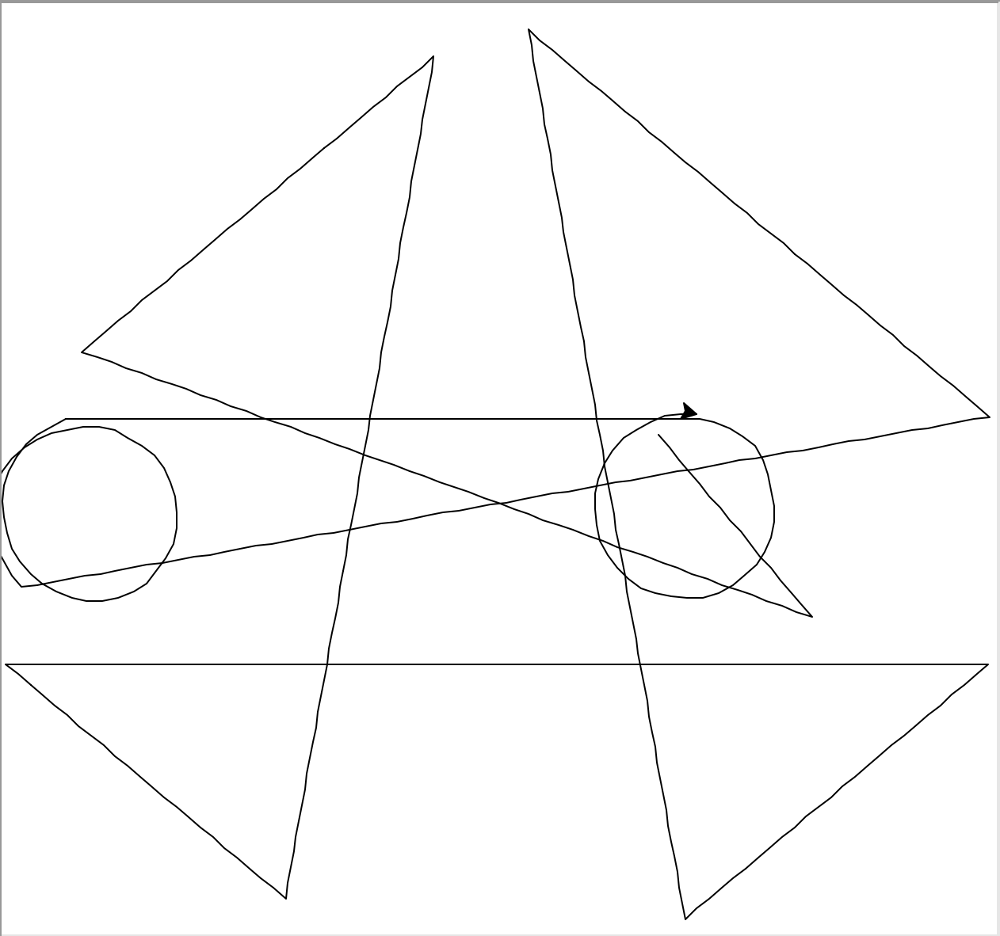

# Day 19 Turtle: Instances, State, Higher Order Functions

## Exercise 19-1: Etch-A-Sketch

### Instructions

1. Using Turtle, create codes that will allow users to enter:
   1. `w` to move forward
   2. `s` to move backwards
   3. `a` to move counter-clockwise
   4. `d` to move clockwise
   5. `c` to clear the screen
2. Make sure to include an `onclick()` option to close screen
3. You can leave the turtle object at default settings

### Example Output

