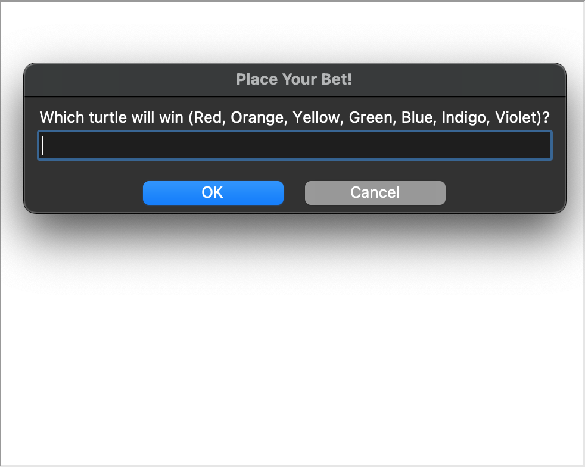
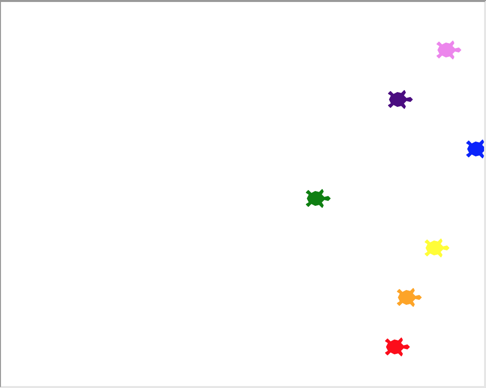

# Day 19 Turtle: Instances, State, Higher Order Functions

## Overview

Day 19 starts with learning how to work with functions in python libraries for key press inputs.

      Exercise 19.1 - Create an Etch-A-Sketch app using key inputs to move the turtle object

## Project 2: Turtle Racing

Using the Turtle package, we will build an app that lets a user pick a color and races against other turtles using randomisation to move each turtle across the screen. The first to reach the end is declared the winner.

### Instructions

1. Create a `colors[]` list for each color you want in the race
2. Create a list to store turtle objects:
   1. Use a `for` loop to create them with each color of the `colors[]` list
   2. Set their positions at the starting line using `goto()`
      1. They should be spaced apart from each other
3. Create a `textinput()` to show a pop-up on start for user:
   1. To enter color of turtle they think will win
   2. Store as a variable for checking bet afterwards
4. Create a way for the game to end when a turtle reaches the "finish line"
   1. Should stop all turtles from moving further
   2. Store the winning turtle information
5. Compare the winning turtle to the user bet and print the result

### Example Output

#### Place Your Bet!

#### Blue Won The Race!

### Comments

In this project, I took things a bit further. I created a function `draw_finish_line()` to create another turtle object to draw a line along the right side of the screen. I also created the function `draw_winner_color()` to show text on the screen with the winning color.

While the program shows print statements in the console, I figured this would be better for a user that did not have a console to see the text when running the app. Or if it doesn't appear like there is just one winner due to ending position being super close.

### Replit Demo

[Replit Demo - Turtle Race 1](https://replit.com/@EoghyUnscripted/Turtle-Race-1)
This demo requires users to log in to experience the demo using the console for input.

[Replit Demo - Turtle Race 2](https://replit.com/@EoghyUnscripted/Turtle-Race-2)
This demo does not need a Replit login and will provide the user with a color at random and run automatically.

#### Demo Issues

While my other projects are hosted to Replit for demo, Replit does not properly function with Turtle unless logged into the development environment after forking. Replit has no support for input with Turtle and requires the console for input. I have posted two links to check out the code in action within these limitations.
