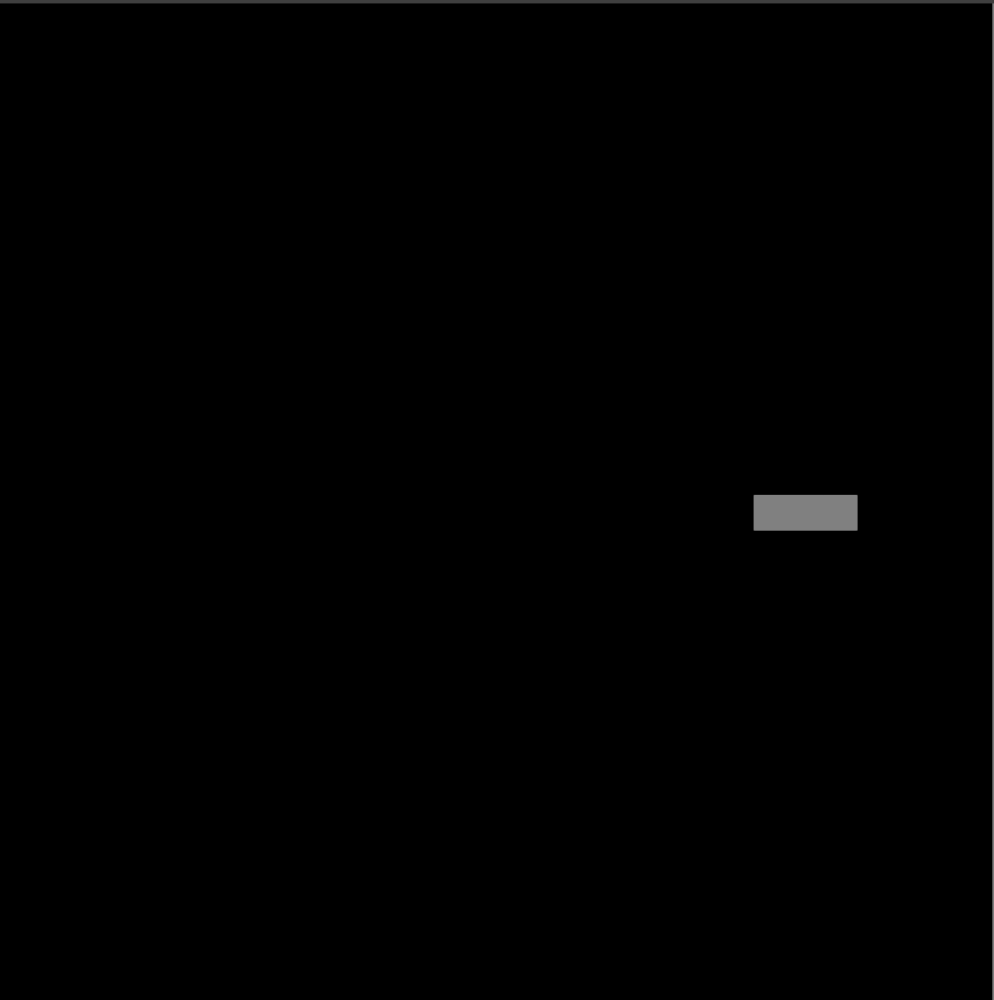

# Day 20 Turtle: Animations & Coordinates

## Project: Snake Game Part 1

Using the Turtle package, we will build a snake game. This will include the object shape, collision detection, user key listeners and a scoreboard.

### Instructions

1. Create a snake body
2. Create a function to constantly move the snake forward
3. Allow user key input to change direction of snake:
   1. North (90 Degrees) = `Up`
   2. South (270 Degrees) = `Down`
   3. East (0 Degrees) = `Right`
   4. West (180) = `Left`

### Example Output

#### Demo Issues

As Replit does not truly support Turtle very well, users may have better luck forking the GitHub repo and running the app through Visual Studio Code or similar editor. However, the program will run on Replit, but users will not get the full experience.

### Replit Demo

[Replit Demo - Snake Game Part 1](https://replit.com/@EoghyUnscripted/Snake-Game-1)
