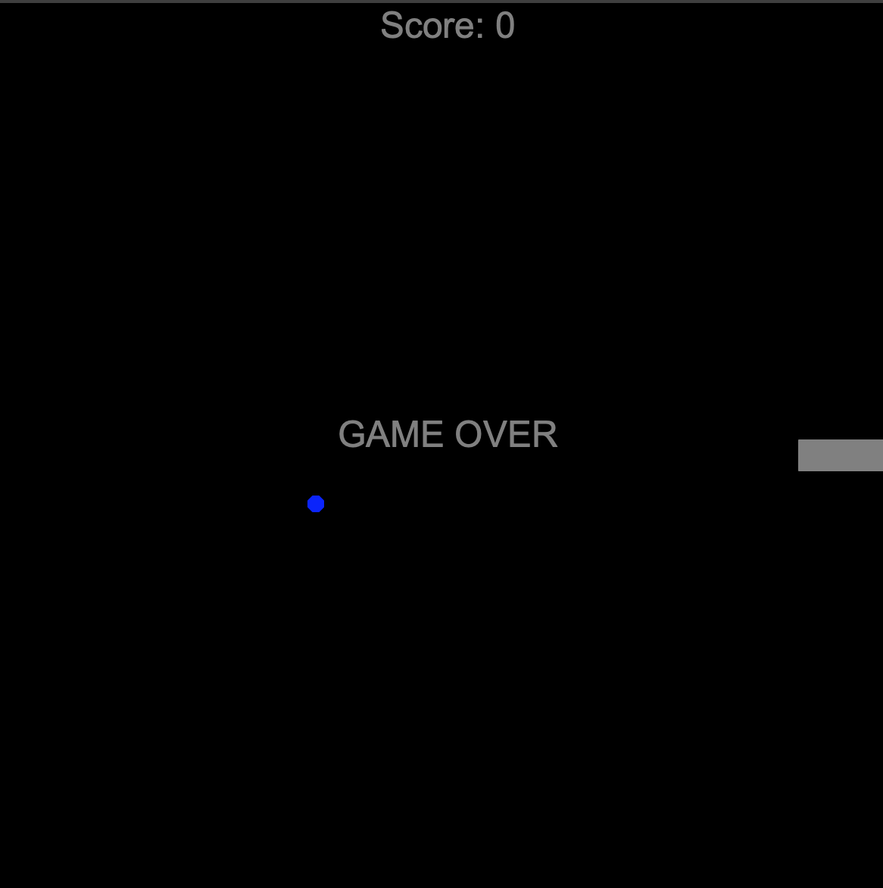

# Day 21 Turtle: Inheritance & List Slicing

## Overview

   We begin day 21 by learning class inheritance and work our way towards list and tuple slicing for reducing code.

## Project: Snake Game Part 2

Using the Turtle package, we will continue part 2 to build a snake game. This will include the object shape, collision detection, user key listeners and a scoreboard.

### Instructions

1. Create `snake food`
2. Create a `scoreboard` object to track the current score
3. Create detection codes for:
   1. Collision with food
   2. Collision with walls
   3. Collision with tail

### Example Output

#### Demo Issues

As Replit does not truly support Turtle very well, users may have better luck forking the GitHub repo and running the app through Visual Studio Code or similar editor. However, the program will run on Replit, but users will not get the full experience.

### Replit Demo

[Replit Demo - Snake Game Part 2](https://replit.com/@EoghyUnscripted/Snake-Game-2)
