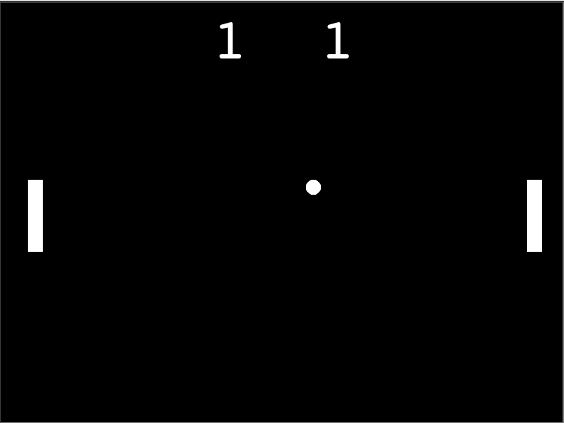

# Day 22 Turtle: Build Pong

## Overview

We begin day 22 by taking what we learned in day 21 and building a Pong arcade game. We will be bringing things one step further by adding another layer of complexity using multiple objects that move with key presses.

## Project: Pong

Using the Turtle package, we will build a Pong game. This will include the object shapes for the paddles, collision detection, user key listeners and a scoreboard.

### Instructions

1. Write a Paddle Class and create the paddles
   1. Write functions to move paddle objects on key press
2. Write a Ball Class and create the ball object
   1. Write a function that moves the ball
   2. Write a function that bounces ball when it hits the top or bottom of screen
   3. Write a function that bounces ball when it hits a paddle and increases the speed
   4. Write a function to reset the ball to the center of screen and restarts at lower speed
3. Write Scorboard class and create a scoreboard object
   1. Write a function that adds points when the other player misses the ball
   2. Write a function that updates the scores during gameplay

### Example Output

#### Demo Issues

As Replit does not truly support Turtle very well, users may have better luck forking the GitHub repo and running the app through Visual Studio Code or similar editor. However, the program will run on Replit, but users will not get the full experience due to screen sizing issues.

### Replit Demo

[Replit Demo - Pong Game](https://replit.com/@EoghyUnscripted/Pong-Game)
