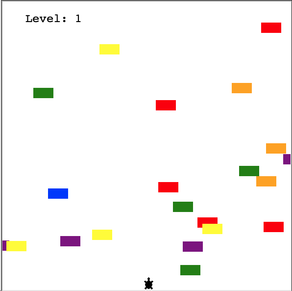
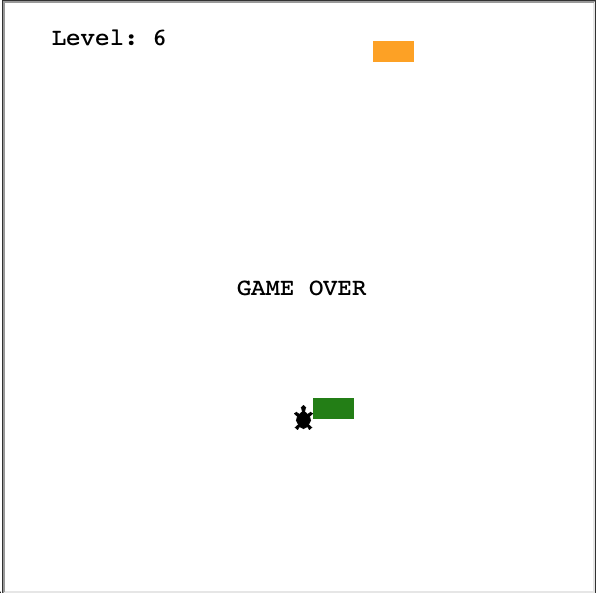

# Day 23 Turtle Crossing

## Overview

   For Day 23, we will be using what we have learned in previous modules to create a Turtle Crossing game.

## Project: Turtle Crossing

Using the Turtle package, we will build the simple Turtle Crossing game using an object as the turtle, and rectangular objects as cars to create traffic on a road. The goal is to get the turtle across traffic without colliding with a car object.

### Instructions

1. Import and setup the Screen environment
2. Add a listener for gameplay key presses
3. Write a Player class and create a player object
   1. Write a function that moves the player along the y-axis when the "Up" key is pressed
   2. Write a function that resets the player to starting position once it reaches the top of the screen
4. Write a Car_Manager class and create the cars
   1. Write a function that randomly generates car objects along the y-axis that move from right to left
      1. A new car should generate every 6th time the game loop
      2. The car object should be 20px by 40px
      3. Car objects should not be generated in the top or bottom 50px of the screen
      4. Randomly generate colors for each car object
   2. Write a function that increases the speed of the cars when the player levels up
5. Write Scorboard class and create a scoreboard object
   1. Write a function that displays the current level on the screen
   2. Write a function to update the score when the player is reset for the next level
   3. Write a function that displays "Game Over" when a collision occurs between a car and the turtle

### Example Output

#### Demo Issues

As Replit does not truly support Turtle very well, users may have better luck forking the GitHub repo and running the app through Visual Studio Code or similar editor. However, the program will run on Replit, but users will not get the full experience due to screen sizing issues.

### Replit Demo

[Replit Demo - Turtle Crossing](https://replit.com/@EoghyUnscripted/Turtle-Crossing)
