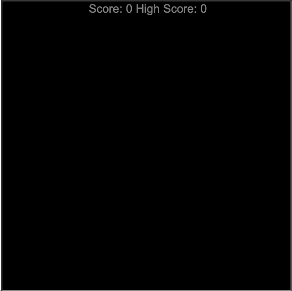
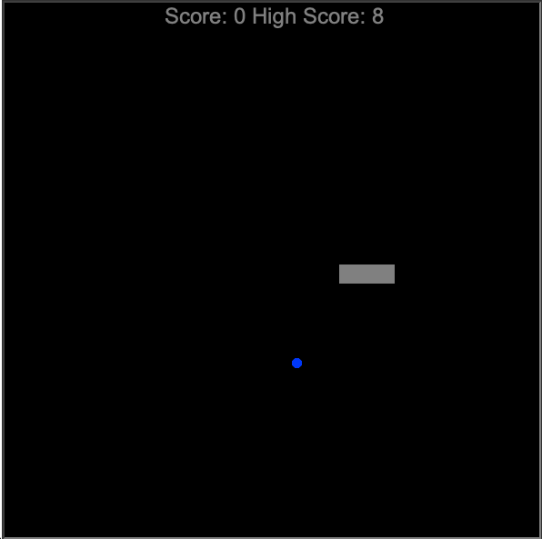
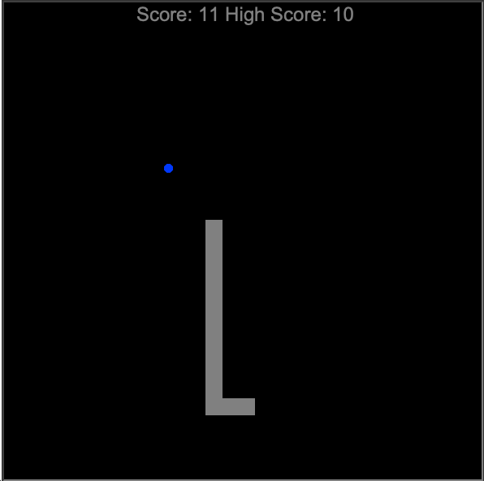

# Day 24 Files, Directories, and Paths

## Exercise 24-1: Storing Highest Score In A File

### Instructions

1. Remove game over function and function calls for continuous play
2. Add high score to __init__ declarations
   1. Set the initial value to the high score stored in file
   2. Use the when open() method to read and write high score values
3. Update scoreboard to write score and high score
4. Add reset function to snake class
   1. Resets snake object to initial values
   2. Remove all existing tail segments
   3. Resets snake object to center of screen
5. Add reset function to scoreboard class
   1. Resets current score to 0
   2. Rewrites scores on screen

### Comments

For this exercise, I chose to create a separate function called `file_high_score` which would accept "r" or "r" as parameter to return an existing score or write a new one. I felt this to be cleaner and more useful than hard-coding in multiple places.

### Output

