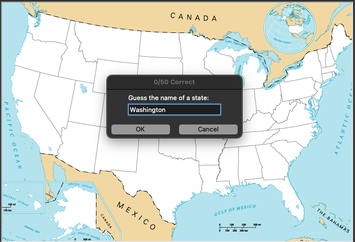
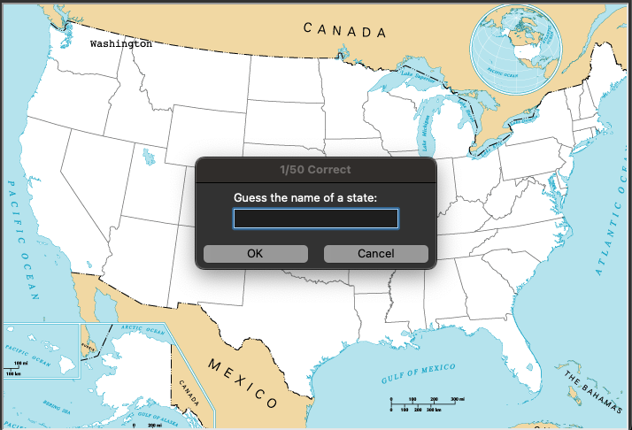

# Day 25 CSV Data, Pandas Library

## Overview

For Day 25, we will start with some exercises to learn how to work with Pandas and csv file data for weather and squirrel census data. The goal is to pull in the data using the Pandas library and use it within our program.

      Exercise 25.1 - Read file content and use the data for mathematical functions
      Exercise 25.2 - Read file content and use built-in functions and conditionals to output analysis results

## Project: U.S. States Game

Using the provided `50_states.csv` file, we will create a game to test how many states a user can guess on the map. The game will use the data file during gameplay to validate answers and lable the states on the map using coordinates within the file.

### Instructions

1. Create the Screen environment and load the US Map image onto the background
2. Create a prompt that accepts user input to guess a state name
3. Validate the input by:
   1. Accepting upper and lowercase input
   2. Matching against a state name in the provided csv file
4. If the user is correct:
   1. Get the coordinates from the file
   2. Write the state name on the map at the coordinates
5. Loop prompt until the count reaches 50
   1. Display current correct guesses / 50 on screen title
6. Write an exit code that will:
   1. Break the gameplay loop
   2. Write the names of the states the user did not guess into a csv file

### Example Input

#### 50_states.csv

```
state,x,y
Alabama,139,-77
Alaska,-204,-170
Arizona,-203,-40
Arkansas,57,-53
California,-297,13
Colorado,-112,20
Connecticut,297,96
Delaware,275,42
Florida,220,-145
Georgia,182,-75
Hawaii,-317,-143
Idaho,-216,122
Illinois,95,37
Indiana,133,39
Iowa,38,65
Kansas,-17,5
Kentucky,149,1
Louisiana,59,-114
Maine,319,164
Maryland,288,27
Massachusetts,312,112
Michigan,148,101
Minnesota,23,135
Mississippi,94,-78
Missouri,49,6
Montana,-141,150
Nebraska,-61,66
Nevada,-257,56
New Hampshire,302,127
New Jersey,282,65
New Mexico,-128,-43
New York,236,104
North Carolina,239,-22
North Dakota,-44,158
Ohio,176,52
Oklahoma,-8,-41
Oregon,-278,138
Pennsylvania,238,72
Rhode Island,318,94
South Carolina,218,-51
South Dakota,-44,109
Tennessee,131,-34
Texas,-38,-106
Utah,-189,34
Vermont,282,154
Virginia,234,12
Washington,-257,193
West Virginia,200,20
Wisconsin,83,113
Wyoming,-134,90
```

### Example Output




#### states_to_learn.csv

      ,state
      0,Arkansas
      1,Wisconsin

### Comments

There are 2 versions of the game in the main directory:

- us_states_game.py
- us_states_game_adj.py

Either file is possible to use within your preferred editor. The only difference is that `us_states_game_adj.py` is modified to accept terminal input instead of an on screen prompt.

#### Demo Notes

In an attempt to host this app on Replit, it became clear that, while Pandas can be installed using the package manager, none of the existing packages function to allow importing pandas for use in the app.
