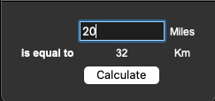

# Day 27 Tkinter, *args, **kwargs, GUI Programs

## Overview

Day 27 is an introduction to Tkinter GUI. We will be learning how to work with the GUI and build an interface using the features available in the library.

## Project: Miles to Kilometers Converter

For this project, we will create a GUI that allows a user to enter a number of miles to convert to kilometers. Once the `calculate` button is pressed, the screen updates with the result.

### Instructions

1. Create labels and set the grid positions for:
   1. `is equal to`
   2. `Miles`
   3. `Km`
   4. `0`
2. Create a button called `calculate`
   1. Set the grid position
   2. Create a function to run onlick
      1. 1 mile = 1.609344 km is the formula
      2. This function should update label 4 which starts with `0`
3. Create an entry box for users to type an integer input to convert to km

### Example Input

### Example Output

### Comments

#### Demo Notes

Tkinter is not supported on Replit and has no demo available.
