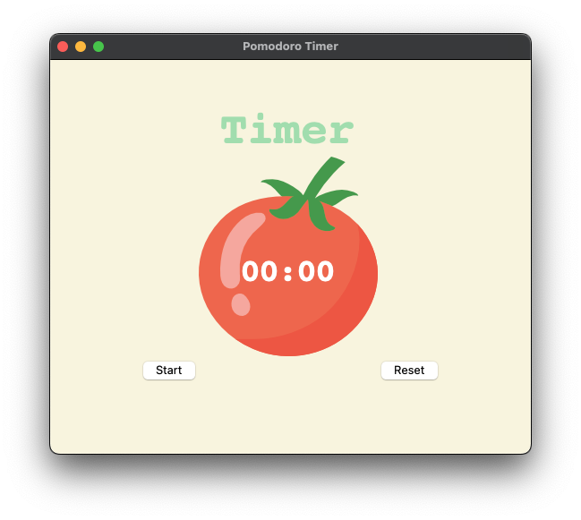
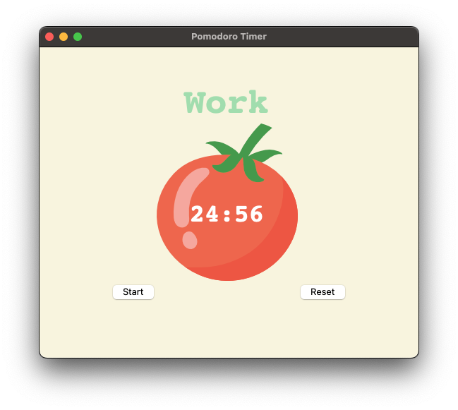
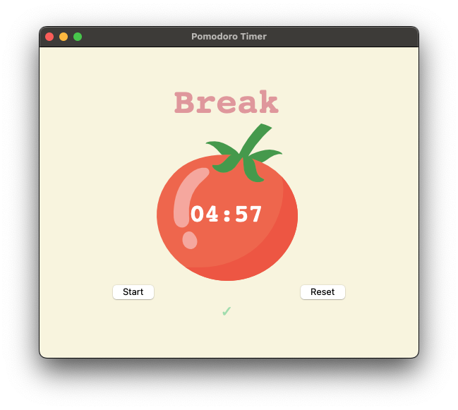
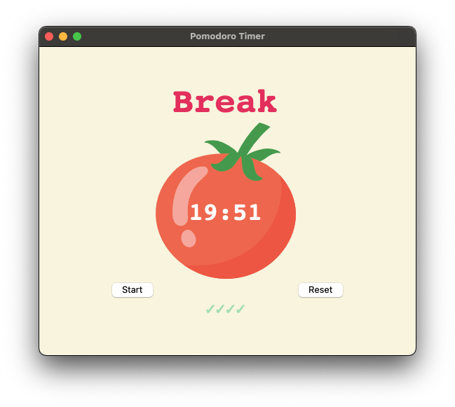

# Day 28 Tkinter, Dynamic Typing, Pomodoro GUI

## Overview

For Day 28, we will be continuing to work with Tkinter to build a Pomodoro Timer GUI.

## Project: Pomodoro Timer GUI

The project is based on the Pomodoro Technique, which has a goal of reducing the effect of internal and external interruptions on focus and flow when working or learning.

The steps of this technique are:

1. Decide on the task to be done
2. Set timer for 25 minutes
3. Work on the task
4. End work when timer is up and take a 5-10 minute break
5. After 4 cycles through steps 1-4:
   1. Take a 20-30 minute break
   2. Restart the Pomodoro cycle

Using the provided code, we will build the components of the GUI and functions using Tkinter to replicate the Pomodoro steps above when the user clicks the `start` button.

### Instructions

1. Create a canvas
   1. Add the tomato image to the canvas
   2. Add the timer inside the tomato image using canvas text
2. Create labels
   1. Title label that says "Timer"
   2. Cycle label that adds a check mark for each Pomodoro cycle
3. Create buttons
   1. `Start` button with onclick to start timers
   2. `Reset` button with onclick to reset to defaults
4. Create functions
   1. Start timer:
      1. Increment cycle count
      2. Set timer based on cycle:
         1. Odd = `25-minute` work session
         2. Even = `5-minute` break
         3. Every 8th cycle = `20-minute` break
   2. Reset timer:
      1. Reset timer label to "00:00"
      2. Reset title label to "Title"
      3. Reset cycle label (check marks) to blank
      4. Reset cycle count to `0`
      5. Stop countdown loop
   3. Countdown Clock:
      1. Pass a time count to the function
         1. Calculated as total_minutes * 60
      2. Set `count_min` variable to get total minutes
      3. Set `count_sec` variable to get total seconds
      4. Write a code to update timer label as it counts down
      5. When minutes or seconds is single-digit:
         1. Write a code to add `0` before the number (i.e. `01:09`)
      6. When minutes or seconds is `0`
         1. White a code to write `00` (i.e. `01:00`)
      7. Create a loop where:
         1. Window refreshes every `1000 ms`
         2. Call the count_down function
         3. Pass the new time to function
         4. Stops when time hits `0`
      8. Write a conditional that:
         1. Starts the next cycle timer when the current hits `0`
         2. Check if cycle is even
            1. Calculates how many work timers completed
            2. Update cycle label with `✓` for each work session

#### Code

```python
# ---------------------------- CONSTANTS ------------------------------- #
PINK = "#e2979c"
RED = "#e7305b"
GREEN = "#9bdeac"
YELLOW = "#f7f5dd"
FONT_NAME = "Courier"
WORK_MIN = 25
SHORT_BREAK_MIN = 5
LONG_BREAK_MIN = 20

# ---------------------------- TIMER RESET ------------------------------- # 

# ---------------------------- TIMER MECHANISM ------------------------------- # 

# ---------------------------- COUNTDOWN MECHANISM ------------------------------- # 

# ---------------------------- UI SETUP ------------------------------- #
```

### Example Input



### Example Output







### Comments

For this project I chose to do a few things differently than required. When the timer hits the 9th cycle, I chose to have the program reset so the user can hit start and loop through the Pomodoro cycles again.

I also added a print function to print the current cycle count to the console for reference. It was used to test the code, but seems reasonable to retain in case the user loses track. Reading the check marks on the screen can be disorienting as it only counts work sessions, not cycles.

#### Demo Notes

Tkinter is not supported on Replit and has no demo available.
