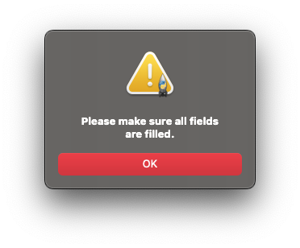
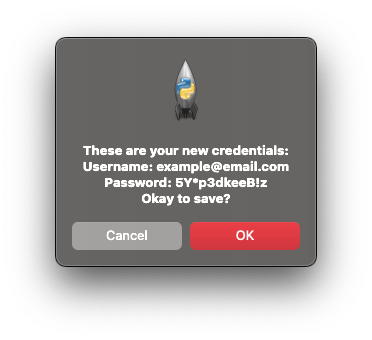

# Day 29 Tkinter Password Manager GUI

## Overview

For Day 29, we will be continuing to work with Tkinter to build a Password Manager GUI. For this project, we will be going a bit further and using file storage.

## Project: Password Manager GUI

The Password Manager GUI will allow users to generate a password and add the password to a save file for storing.

### Instructions

1. Create a canvas:
   1. Width = 200, Height = 200, Padding = 20
   2. Use the `logo.png` image for the canvas image
2. Create labels for:
   1. Website, Email/Username, Password
3. Create text entry boxes for:
   1. Website
      1. Width = 35, span 2 columns
      2. Set cursor to start in this text entry box
   2. Email/Username
      1. Width = 35, span 2 columns
      2. Set with default email placeholder
   3. Password, width = 21
4. Create buttons to:
   1. `Generate Password`
   2. `Add`, width = 21
5. Create functions to:
   1. Generate password on `Generate Password` button click
      1. Use code provided to generate new passwords
      2. Copy generated password to clipboard
   2. Add/Save credentials to a file on `Add` button click
      1. Use a pop up for user to confirm credentials or cancel
         1. Clear UI if user confirms
         2. Do nothing if user cancels

#### Code

generator.py

   ```python

   import random
   letters = ['a', 'b', 'c', 'd', 'e', 'f', 'g', 'h', 'i', 'j', 'k', 'l', 'm', 'n', 'o', 'p', 'q', 'r', 's', 't', 'u', 'v', 'w', 'x', 'y', 'z', 'A', 'B', 'C', 'D', 'E', 'F', 'G', 'H', 'I', 'J', 'K', 'L', 'M', 'N', 'O', 'P', 'Q', 'R', 'S', 'T', 'U', 'V', 'W', 'X', 'Y', 'Z']
   numbers = ['0', '1', '2', '3', '4', '5', '6', '7', '8', '9']
   symbols = ['!', '#', '$', '%', '&', '(', ')', '*', '+']

   nr_letters = random.randint(8, 10)
   nr_symbols = random.randint(2, 4)
   nr_numbers = random.randint(2, 4)

   password_list = []

   for char in range(nr_letters):
   password_list.append(random.choice(letters))

   for char in range(nr_symbols):
   password_list += random.choice(symbols)

   for char in range(nr_numbers):
   password_list += random.choice(numbers)

   random.shuffle(password_list)

   password = ""
   for char in password_list:
   password += char

   print(f"Your password is: {password}")

   ```

### Example Input


### Example Output






password_file.txt

```sha
Amazon | example@email.com | 5Y*p3dkeeB!z
```

### Comments

For the `generator.py` file, I went through and condensed the code down using list comprehension and "pythonized" some of the bulky code down. This cleans up the code and makes it easier to read and work with. For example, it returns the password string instead of printing to the console.

#### Demo Notes

Tkinter is not supported on Replit and has no demo available.
