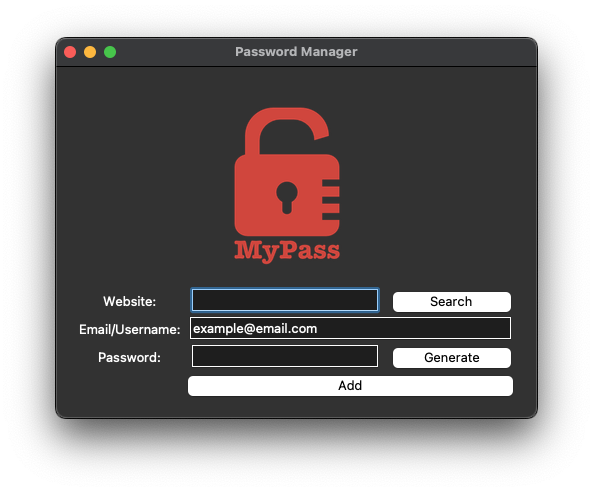
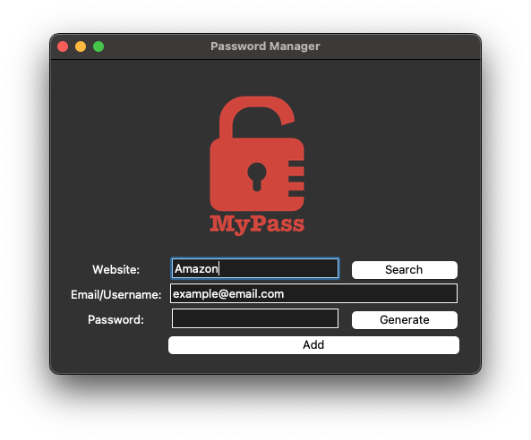
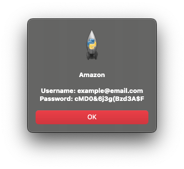
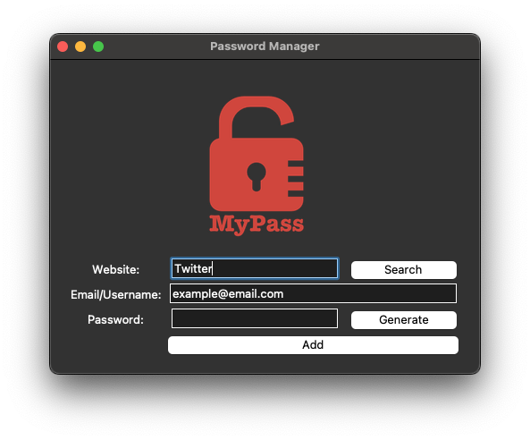
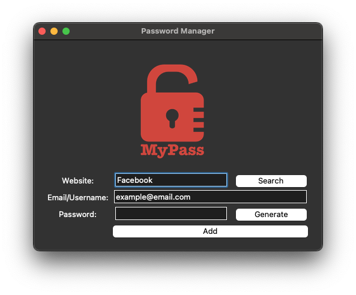
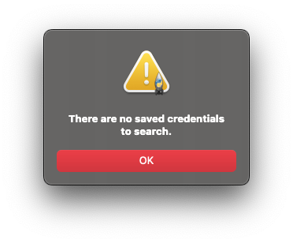

# Day 30 Errors, Exceptions, JSON Data

## Overview

For Day 30, we will be moving into errors, exceptions and JSON data with Python to improve on the Password Manager GUI from day 29.

    Exercise 30-1: IndexError Handling
    Exercise 30-2: KeyError Handling
    Exercise 30-3: Exception Handling with the NATO Alphabet Project

## Project: Password Manager Enhanced

For this project, we will be enhancing the Password Manager GUI from day 29 to include JSON data, a search feature to find existing username and passwords, and using exception handling to prevent errors.

### Instructions

1. Using JSON:
   1. Create code to read the JSON data from `password_file.json`
   2. Create code that will update `password_file.json` with new data
      1. EXAMPLE: If there is an existing Amazon username and password, it will update to the new credentials
      2. EXAMPLE: If the user adds a new website credentials, it will append to the JSON data in proper structure
   3. Error Handling:
      1. `FileNotFound` - If the file does not exist, create the file and write new credentials
2. Add `Search` button to the GUI next to the website text entry box
   1. Adjust the button and website text entry box size to fit the GUI
   2. Set an onclick command to search the JSON data file for an existing username and password for a website
   3. Create a pop up message that gives existing username and password if in the `password_file.json` file
   4. Error Handling:
      1. `FileNotFound` - If the file does not exist, alert the user that no credentials exist
      2. `KeyError` - If the website does not have an existing username and password, alert user with a pop up message

### Example Input

### Example Output

#### No Errors

#### KeyError Exception

#### FileNotFound Exception

### Comments

#### Demo Notes

Tkinter is not supported on Replit and has no demo available.
