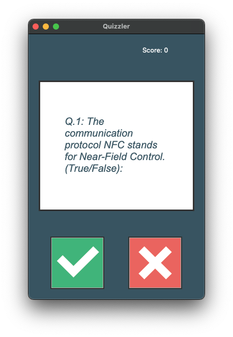

# Day 34 API GUI Quiz App

## Overview

For Day 34, we will be continuing to work with APIs by recreating the Quiz Game from day 17.

## Project: Quiz Game

The goal of the project is to upgrade some features for the Quiz Game from day 17 and convert it from a console-based program to a Tkinter GUI. We will also be replacing the data in the external file which holds the quiz questions in a dictionary using an API call to change them each time the program is run.

### Instructions

1. Create an API request to [Open Trivia Database](https://opentdb.com/api.php?amount=10&type=boolean)
   1. Pull 10 True/False trivia questions
   2. Convert the data to JSON and load into the `question_list`
2. Create the Tkinter GUI as a Class
   1. Use `ui.py` as the class file
   2. Create the buttons
      1. True
         1. Image: `true.png`
         2. Grid: row=2, column=0
      2. False
         1. Image: `false.png`
         2. Grid: row=2, column=1
   3. Create the canvas
      1. Config: width=300, height=250, bg="white"
      2. Grid: row=1, column=0, columnspan=2, pady=50
      3. Text: 150, 125, width=200, font=("Arial", 20, "italic")
   4. Create the label
      1. Config: text="Score: 0", fg="white"
      2. Grid: row=0, column=1
3. Create functions
   1. Feedback:
      1. Checks if user answered correctly
         1. If correct, update score label
      2. Sets the canvas and text color
         1. If Wrong: bg="red", fill="white"
         2. If Right: bg="green", fill="white"
      3. Gets next question after 1000ms
   2. Button Presses:
      1. `True`, `False`
         1. Calls feedback
         2. Passes the quess to compare to answer
4. Update functions
   1. Get Next Question:
      1. Add code to call to check if there are more questions
         1. If false, call final score function
         2. If true, get next question
   2. Check Answer:
      1. Modify function to return `True` or `False`

### Example Input

#### Game Start

#### Right Guess

#### Wrong Guess

### Example Output

#### Winning Game

#### Losing Game

### Comments

Contrary to the lesson, I moved most of my functions and classes into separate files to call on during gameplay. I chose this route to keep the code cleaner.

It does make it a bit more complex when working with the code, but the overall results make it easier to change up the data and enhance the gameplay.

#### Additions

In the `final_score` function, I passed attributes from `QuizBrainUI` into the function to update the final score and UI to keep it all together instead of using `get_next_question` to update the GUI at the end of the game.

#### Demo Notes

Tkinter is not supported in Replit so no demo is available.
