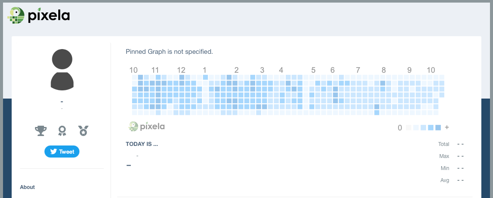
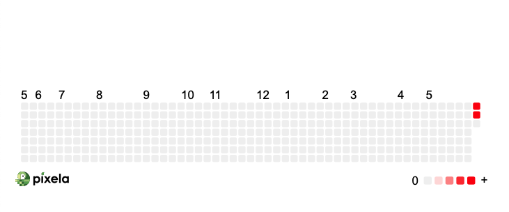

# Day 37 API Post Requests & Headers

## Overview

For Day 37, we will be moving beyond API Get requests and into API Post Requests and HTTP headers to build a habit tracking app using Pixela.

## Project: Habit Tracker

The habit tracker project is an open-ended one where you can choose what habit you want to track, be it cycling, meditating, walking, whatever you choose. Review the API documentation to determine for creating your graph to see all of the options available.

### Setup

- [Pixela](https://www.pixe.la) - Review the documentation at the bottom of the main page to learn how to set up your account
  - NOTE: You will need to generate your own API Key - see [Additional Resources](#additional-resources)

### Instructions

1. Setup your user account with Pixela
   1. [Create New Pixela User](https://docs.pixe.la/entry/post-user)
2. Create a new graph for habit tracking
   1. [Create New Pixelation Graph](https://docs.pixe.la/entry/post-graph)
3. Write an API call to POST a Pixel to the new graph
   1. [Record A Pixel](https://docs.pixe.la/entry/post-pixel)

### Example Output

#### Pixela Profile Created



#### Pixela Graph Created & Pixel Posted



### Comments

For this project, I chose to make it a steps tracking app where the user can add an input to pass into the graph. Effectively, you could remove the `get_Input()` function and just call the `post_Pixel()` and pass the data you want.

For example, if you wanted to simply post a pixel any time you run the app, you can use [Increment Pixel Quantity](https://docs.pixe.la/entry/increment-pixel).

#### Forking

If you chose to fork this app, please be sure to update the variables in `habit_tracker.py` with your own data. I recommend setting them as environment variables while your code is open to the public.

For example:

```python
import os

api = os.environ['API_KEY']
```

To set your environment variables, open the `terminal` in your editor and navigate to your environment directory. Create each of your variables using the format below:

```sh
export API_KEY="enterYourStringHere"
```

#### Additional Resources

- [How to Set and Get Environment Variables in Python](https://able.bio/rhett/how-to-set-and-get-environment-variables-in-python--274rgt5) - This is a great resource to learn how to create persistent environment variables
- [JSON Viewer](http://jsonviewer.stack.hu) - This site is a useful app that converts single line JSON to formatted for readability
- [Pixela API Documentation](https://docs.pixe.la/) - API Documentation for referencing
- [API Key Generator](https://codepen.io/corenominal/pen/rxOmMJ) - This Codepen allows you to generate a random API Key that meets the qualifications for Pixela
