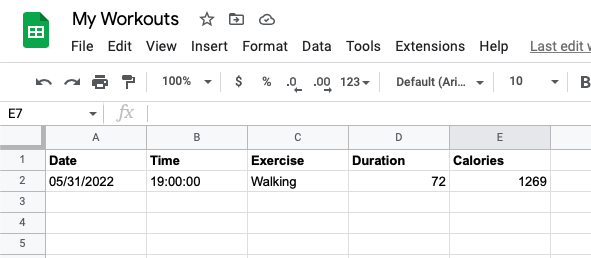
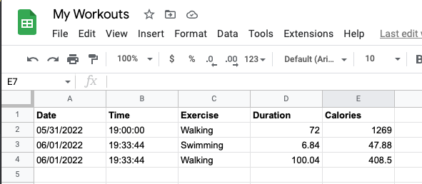

# Day 38 Tracking App Using Google Sheets

## Overview

For Day 38, we will be building an exercise tracking app that updates Google sheets with new information as it is passed through.

## Project: Exercise Tracker

This project is intended to use a natural language processing API to convert the user input and calculate calories burned. It will track every conversion and add it to the Google Sheets spreadsheet that we will copy during setup.

### Setup

1. Sign up for Google Sheets or log in to your gmail account
   1. Got to [My Workouts Spreadsheet](https://docs.google.com/spreadsheets/d/1DHL6Y8XAHSC_KhJsa9QMekwP8b4YheWZY_sxlH3i494/edit?usp=sharing) and make a copy
   2. File -> Make A copy
2. Get an API key for [Nutritionix](https://www.nutritionix.com/business/api) by signing up for a free account
3. Log in with [Sheety (Google)](https://sheety.co) using the same email account for Google Sheets

### Instructions

1. Using the [Nutritionix API Docs](https://docs.google.com/document/d/1_q-K-ObMTZvO0qUEAxROrN3bwMujwAN25sLHwJzliK0/edit#)
   1. Create an API call to post user input exercise data to the API
2. Using the [Sheety Docs](https://sheety.co/docs)
   1. Create an API call to post the data for Google Sheets
      1. Date
      2. Time
      3. Exercise
      4. Duration
      5. Calories

### Example Input

#### Console Input

      What did you do for exercises, today?: swam 10 laps and walked 5 miles

#### Google Sheets Input



### Example Output

#### Console Output

      {
      "workout": {
         "date": "06/01/2022",
         "time": "19:33:44",
         "exercise": "Swimming",
         "duration": 6.84,
         "calories": 47.88,
         "id": 3
      }
      }
      {
      "workout": {
         "date": "06/01/2022",
         "time": "19:33:44",
         "exercise": "Walking",
         "duration": 100.04,
         "calories": 408.5,
         "id": 4
      }
      }

#### Google Sheets Output



### Comments

#### Forking

If you chose to fork this app, please be sure to update the variables in `api_caller.py` with your own data. I recommend setting them as environment variables while your code is open to the public.

For example:

```python
import os

api = os.environ['API_KEY']
```

To set your environment variables, open the `terminal` in your editor and navigate to your environment directory. Create each of your variables using the format below:

```sh
export API_KEY="enterYourStringHere"
```

#### Additional Resources

- [How to Set and Get Environment Variables in Python](https://able.bio/rhett/how-to-set-and-get-environment-variables-in-python--274rgt5) - This is a great resource to learn how to create persistent environment variables
- [JSON Viewer](http://jsonviewer.stack.hu) - This site is a useful app that converts single line JSON to formatted for readability
- [API Key Generator](https://codepen.io/corenominal/pen/rxOmMJ) - This Codepen allows you to generate a random API Key that meets the qualifications for Pixela
