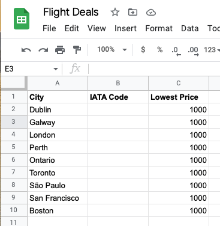
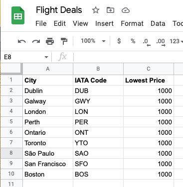
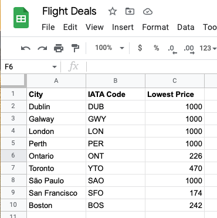
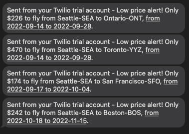

# Day 39 Flight Deal Finder

## Overview

For Day 39, we will be taking everything we have learned so far about APIs and building a flight deal finder. This project will span two days and once completed, we will have a fully functioning product that allows users to sign up and search for cheap flights.

## Project: Capstone Project Part 1 - Cheap Flight Finder

Today's project will start with the basic build. We will put together the pieces required to build a prototype for single use.

### Setup

- Sign up for Google Sheets or log in to your gmail account
  - Got to [Flight Deals Spreadsheet](https://docs.google.com/spreadsheets/d/1YMK-kYDYwuiGZoawQy7zyDjEIU9u8oggCV4H2M9j7os/edit#gid=0) and make a copy
  - File -> Make A copy
  - Alternatively, you can create your own
- Get an API key for [Kiwi Partners Flight Search](https://partners.kiwi.com) by signing up for an account
  - NOTE: The course states this API requires credit card for security but did not require one for me to sign up
- Log in with [Sheety (Google)](https://sheety.co) using the same email account for Google Sheets
  - Connect to the Google Sheet you just copied using Sheety, it will do the rest for you
  - Enable `GET`, `POST`, and `PUT` in the Sheety settings for your connected spreadsheet
  - NOTE: If you have set persistent environment variables using Day 38 with Sheety, you need to create new variables
- [Twilio Console](https://www.twilio.com) - Sign up to get an Account SID, Auth Token, trial number and credits for testing
  - You will need a mobile device that you can use to test
- [Twilio-CLI](https://www.twilio.com/docs/twilio-cli/quickstart) - Install the `twilio-cli` package

### Instructions

1. Create an API call for the `flight_search.py` class
   1. Search for flights starting tomorrow to 6 months out:
      1. Use `dd/mm/YYYY` date format
      2. Use the Google Sheets data to find comparisons
2. Create the functions in `data_manager.py`
   1. Collect the data from Google Sheets for comparisons
   2. Update Google Sheets with new data:
      1. IATA Codes if originally blank
      2. New lowest price data from flight search
3. Create `flight_data.py`
   1. Use this class to structure the data when initialized
   2. This will hold the information for current returned flight data
4. Create the functions in `notification_manager.py`
   1. Send an SMS alert when there is a cheaper flight compared to Google Sheets

### Example Input

#### Google Sheets - Initial Data

### Example Output

#### Google Sheets - Updated IATA

#### Google Sheets - Updated Lowest Prices (USD)

#### Twilio - SMS Messages

### Comments

This project has quite a few enhancement opportunities as-is. While this may be the case, we will be working on expanding this application on Day 40 into a fully fleshed application.

#### Forking

When forking, please update the environment variables in the `__init__` definitions in:
  
- `data_manager.py`
- `flight_search.py`
  - Also update the `departure` variable found in `get_Flights()` to the IATA code for your airport
- `notification_manager.py`

#### Additional Resources

- [How to Set and Get Environment Variables in Python](https://able.bio/rhett/how-to-set-and-get-environment-variables-in-python--274rgt5) - This is a great resource to learn how to create persistent environment variables
- [JSON Viewer](http://jsonviewer.stack.hu) - This site is a useful app that converts single line JSON to formatted for readability
- [API Key Generator](https://codepen.io/corenominal/pen/rxOmMJ) - This Codepen allows you to generate a random API Key that meets the qualifications for Pixela
