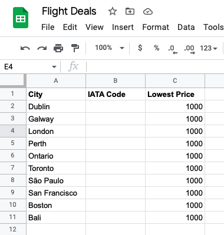
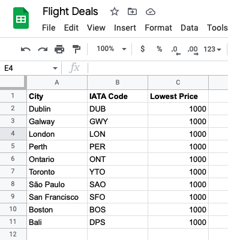
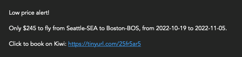

# Day 40 Flight Club

## Overview

For Day 40, we will be using the completed project from day 39 and updating it with some additional features.

## Project: Capstone Project Part 2 - Flight Club

With the day 39 files, we will be updating the project to send emails and check for error handling. If a direct flight cannot be found, the project will check for one with a layover. If there is a lower price deal, the app will email the details and a booking link to the emails listed on Google Sheets.

### Setup

- This project uses the same files and setup from Day 39, minus Twilio
- Add a tab to the Google Sheets spreadsheet you copied from Day 39 and label it `users`
- Go to your Sheety dashboard and refresh the project to update

### Instructions

1. Update the code in the `flight_search.py` class
   1. Use error handling to return `None` when no flight data is received from the API call for a destination
2. Update the `__init__` parameters in `flight_data.py` to include optional parameters
   1. `lay_overs = 0` - Will set to 1 when there is no direct flight
   2. `via_city = ""` - Will set to the layover city name
3. Write a code that runs when no direct flights are found to the destination city
   1. This will check for flights with 1 layover to the destination city
   2. Record the layover city name
4. Update `notifications_manager.py`
   1. Remove the Twilio sms function
   2. Create a function to use email and SMTPLIB to send notifications
   3. Update `__init__` with global variables for SMTPLIB

### Example Input

#### Google Sheets - Initial Data

### Example Output

#### Google Sheets - Updated IATA

#### Google Sheets - Updated Lowest Prices (USD)

#### SMTP - Email Messages

### Comments

For this project, I made some changes and left out some of the content:

- Google Link in email for booking
  - The Kiwi/Tequila API provides a booking link
  - I used this link with the `pyshorteners` package to send a clean link via email
- User Sign Up
  - I chose to omit this piece as I have no intention on hosting this project
  - If users want to explore the code, they can easily create their own data in the backend on Google Sheets

#### Forking

When forking, please update the environment variables in the `__init__` definitions in:
  
- `data_manager.py`
- `flight_search.py`
  - Also update the `departure` variable found in `get_Flights()` to the IATA code for your airport
- `notification_manager.py`

#### Additional Resources

- [How to Set and Get Environment Variables in Python](https://able.bio/rhett/how-to-set-and-get-environment-variables-in-python--274rgt5) - This is a great resource to learn how to create persistent environment variables
- [JSON Viewer](http://jsonviewer.stack.hu) - This site is a useful app that converts single line JSON to formatted for readability
- [API Key Generator](https://codepen.io/corenominal/pen/rxOmMJ) - This Codepen allows you to generate a random API Key that meets the qualifications for Pixela
