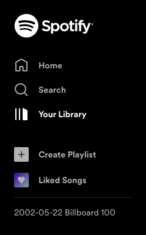

# Day 46 Musical Time Machine

## Overview

For Day 46, we will be continuing with web scraping to add songs to a Spotify playlist.

## Project: Musical Time Machine

For this project, we will be using `Beautiful Soup` to scrape the hottests songs from the Billboard Hot 100 for a selected era and adding them to a Spotify playlist.

### Setup

- Get an account with [Spotify](https://www.spotify.com/us/)

### Instructions

Using [Billboard Hot 100](https://www.billboard.com/charts/hot-100/):

1. Create a program that asks for user input to enter a date in `YYYY-MM-DD` format
2. Add this date at the end of the Billboard Hot 100 link and scrape the song titles from the page
   1. i.e. <https://www.billboard.com/charts/hot-100/2002-05-22>

### Example Input

      Let's visit the musical past. Type in a year and let's do the time warp! [YYYY-MM-DD]: 2002-05-22

### Example Output

### Comments

Due to the lack of usable information on the Spotipy documentation page, I was unable to complete the assignment on my own. I had to copy the code from the solution provided to get a functioning program. I read through the entire documentation and was able to discover that there is a `search` function. However, the only information provided is:

      search(q, limit=10, offset=0, type='track', market=None)
      searches for an item

            Parameters:

                  q - the search query (see how to write a query in the official documentation 
                                          https://developer.spotify.com/documentation/web-api/reference/search/search/) # noqa
      
                  limit - the number of items to return (min = 1, default = 10, max = 50)

                  offset - the index of the first item to return

                  type - the type of item to return. One of ‘artist’, ‘album’, ‘track’, ‘playlist’, ‘show’, or ‘episode’

                  market - An ISO 3166-1 alpha-2 country code or the string from_token.

When attempting to review the official documentation for examples, it simply downloaded an empty file. When searching on [Spotify Developer Documentation](https://developer.spotify.com), I was still unable to find any resource for the `search` function or how to build a query.

Since a Spotify URI is required for this app, and the only way to pull it is using `search`, this would have been a failure on my part to solve.

### Additional Resources

- [Spotipy Docmentation](https://spotipy.readthedocs.io/en/2.13.0/) - Documentation for the Spotopy module
- [Spotify Developer Documentation](https://developer.spotify.com) - Spotify Official API documentation
