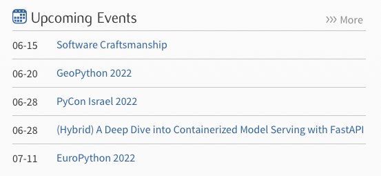
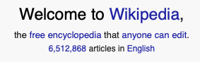
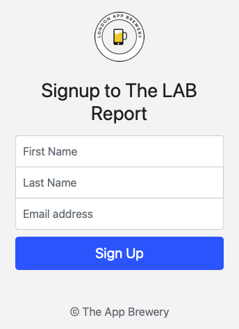

# Day 48 Selenium Webdriver Browser

## Exercise 48-1: Python.org

For this exercise, we will use Selenium to scrape some data from the main Python webpage.

### Instructions

1. With [Python Homepage](https://www.python.org):
   1. Write Selenium commands to open browser to the page
   2. Search for the events list
   3. Pull the date and name of the event
   4. Add to a dictionary

### Example Input

### Example Output

    2022-06-15 Software Craftsmanship
    2022-06-20 GeoPython 2022
    2022-06-28 PyCon Israel 2022
    2022-06-28 (Hybrid) A Deep Dive into Containerized Model Serving with FastAPI
    2022-07-11 EuroPython 2022

### Comments

I chose to modify the output so that it was in readable format instead of as a dictionary.

## Exercise 48-2: Wikipedia.org

For this exercise, we will use Selenium to scrape some data from the main Wikipedia webpage.

### Instructions

1. With [Wikipedia](https://en.wikipedia.org/wiki/Main_Page):
   1. Write Selenium commands to open browser to the page
   2. Search for the article count
   3. Pull the number into a variable
   4. Print to console

### Example Input

### Example Output

    6,512,868

## Exercise 48-3: App Brewery Newsletter

For this exercise, we will use Selenium to scrape some data from the the App Brewery Newsletter signup page and automate form filling.

### Instructions

1. With [The App Brewery Demo Page](http://secure-retreat-92358.herokuapp.com):
   1. Write Selenium commands to open browser to the page
   2. Search for the fields
   3. Push data to the fields
   4. Submit the form, automatically

### Example Input

### Example Output

