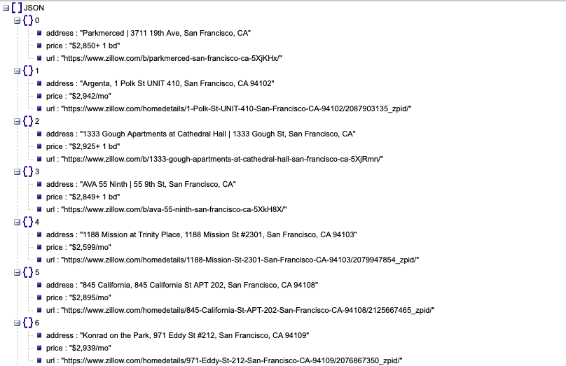
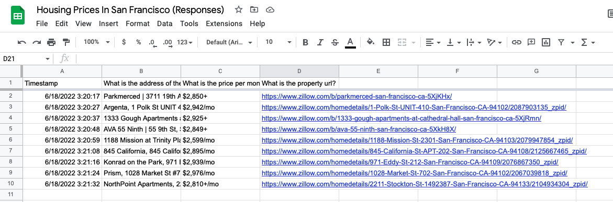

# Day 53 Web Scraping Data Entry Jobs

## Overview

For Day 53, we will working on a capstone project with Selenium and web scraping.

## Project: Instagram Follower Bot

The project for today will use everything we have learned with BeautifulSoup and Selenium to find house prices on Zillow and write the data to a Google Form and export to a Google spreadsheet.

### Setup

1. Sign up with [Google](https://www.google.com)
2. Create a [Google Form](https://docs.google.com/forms/)
   1. Create 3 "short-answer" questions:
      1. What is the address of the property?
      2. What is the price per month?
      3. What is the property url?
   2. Click send
   3. Copy the link address to the form for your program

### Instructions

1. Using `BeautifulSoup`:
   1. Get html from [Zillow](https://www.zillow.com/) with ***$3,000*** max price and ***1br+***
   2. Append to lists:
      1. Addresses
      2. Prices
      3. URLs
2. Using `Selenium`:
   1. Navigate to the Google form url you created
   2. For each listing:
      1. Pass the information to the form fields
      2. Submit

### Example Input

### Example Ouput

### Comments

This project was actually very easy to create given the requirements. I think a lot of that had to do with the simplicity of the Zillow website and being able to use the BeautifulSoup module.

I find that Selenium is easier to use when there aren't so many hurdles to deal with in the process. For example, dynamic pages that change elements based on where you click.

#### Issues

- The only issue I had with this project was remembering to use `select` with BeautifulSoup to directly target a CSS selector like `.this_is_a_class` instead of `find()`.

### Forking

- The `Chromedriver` path will be the direct path to your local chromedriver executable which will launch when called to automate your chrome browser

### Additional Resources

- [ChromeDriver](https://chromedriver.chromium.org/downloads) - Download page for the Google Chrome webdriver executable
- [Selenium Documentation](https://selenium-python.readthedocs.io/) - Documentation for using Selenium
- [Beautiful Soup Documentation](https://www.crummy.com/software/BeautifulSoup/bs4/doc/)  - Documentation for the Beautiful Soup module
