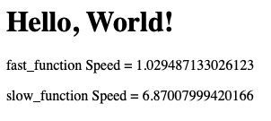

# Day 54 Intro to Flask

## Overview

For Day 54, we are moving into working with Flask.

## Project: Hello Flask

For this project we will learn the basics on starting our first Flask app and create a decorator function.

### Setup

1. Install [Flask](https://pypi.org/project/Flask/)

### Instructions

1. Create a new function with the output:
   1. `<h1>Hello, World!</h1>`
2. Using the provided code:
   1. Create the code for the `speed_calc_decorator()` to output the speed of calculation for:
      1. `fast_function()`
      2. `slow_function()`
   2. i.e. output of second run - output of first run = speed of calculation

#### Code

```python

def speed_calc_decorator():

    pass

def fast_function():
    for i in range(10000000):
        i * i

def slow_function():
    for i in range(100000000):
        i * i

```

### Example Output 1

```sh
First run: 1598524371.736911
Second run: 1598524436.357875
```

### Example Output 2

```sh
Time Difference = 1598524436.357875 - 1598524371.736911
Time Difference = 64.62096405029297
```

### Example Output 3



### Comments

While the course required using the Replit link provided to create a decorator function, I chose to incorporate it into the main project.

### Additional Resources

- [Flask Documentation](https://flask.palletsprojects.com/en/2.1.x/) - Documentation for the Flask package
